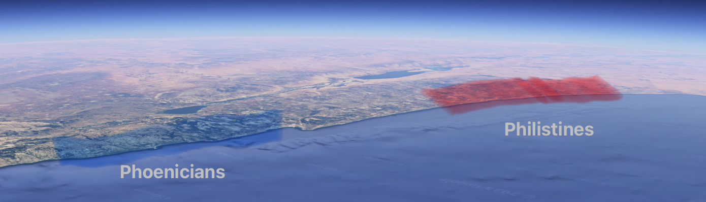

{
  "tags": ["Jewish Antiquity", "Israel", "palestine"],
  "level": "2",
  "updated": "2025-03-10T16:23:17.341Z"
}

# Philistines and Palestinians

Palestinians, who claim to be from the original nations of the land of Israel, take their name from the [Philistines](Pelishtim.md). The nation the Greeks and then the Romans, precursors of the West, decided to call this piece of land they saw from the sea to the south of the Phoenicians.

But do you know where the name Philistines comes from? well theres still no definite consensus, but the semitic word פלש the root of the word **פלש**תים which the semites of the land (The Israelites) called their neighbours to the west actually means... **invasion**! Pretty ironic...

