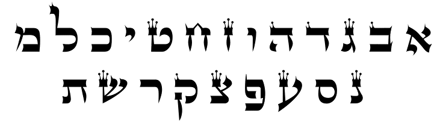

{
  "tags": ["Jewish History", "Language"],
  "level": "4.b",
  "updated": "2025-03-31T17:31:41.000Z"
}

# The First Hebrew Alphabet

Nowadays, the Hebrew alphabet appears quite square-shaped. It’s a familiar form that we’ve been accustomed to for the past 2,000 years, which in all its forms is always essentially a variation of this:

This blocky font called by our sages כתב אשורית, the Assyrian script, is interestingly enough related to the most famous script of the modern world: the [latin letters](https://en.wikipedia.org/wiki/Latin_alphabet), and both (The Latin by way of the Greek letters), can also trace their roots to the first “[Abjad](https://en.wikipedia.org/wiki/Abjad)”[^*] in history: The old Hebrew script!

But before we start talking about the old Hebrew alphabet let’s explain what an “**Abjad**” is. 

### Abjads

Abjads like Alphabets are scripts that use symbols to express bits of sounds, these bits then make up the longer sounds humans use to express themselves and describe the world. Incidentally the difference between each of them is that Alphabets also contain symbols for vowels while Abjads need extra symbols to depict vowels. But its important to note that Alphabets were derived from Abjads and this revolutionary idea of using symbols for sounds and not concepts was first introduced by Abjads.

Prior to this invention, scripts like the one famously used in ancient Egypt for their [Hieroglyphs](https://en.wikipedia.org/wiki/Egyptian_hieroglyphs) and the one used by the [Chinese](https://commons.wikimedia.org/wiki/File:%E5%A7%93%E8%A7%A3_Digidepo_1287529_00000014(2)_(cropped).jpg#/media/File:%E5%A7%93%E8%A7%A3_Digidepo_1287529_00000014(2)_(cropped).jpg) to this day, used symbols that each represented a specific idea. Because of this, these types of script require a massive amount of symbols to be stored<?>, since the real world has an abundance of different concepts that these symbols need to each point to. 

Abjads and Alphabets massively simplified the amount of symbols needed by having symbols just for the most simple sounds our throats and mouths could make, these then could be stringed together to form the words that represented the concepts themselves. Since there's much less simple sounds our mouth can make that there is concepts in the real world this simplified the symbols massively. 

...

[^*]: Im using Abjad here to also include Alphabets, the main idea in both being that symbols express particular sounds and not ideas
